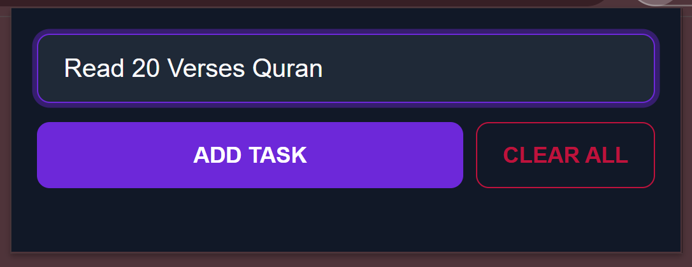

# TaskFlow - A Modern To-Do List Chrome Extension

TaskFlow is a sleek, beautiful, and intuitive to-do list built as a Chrome extension using pure HTML, CSS, and JavaScript. It's designed to be fast, user-friendly, and visually pleasing, with a modern dark-theme UI.

---

### ## Previews

|                    Main View                     |                 Completed Task                 |                 Empty State                 |
| :----------------------------------------------: | :--------------------------------------------: | :-----------------------------------------: |
|  |  |  |

---

### ## ✨ Core Features

- **Add & Manage Tasks:** Quickly add new tasks with the "Enter" key or "ADD TASK" button.
- **Task Completion:** Simply click on a task to toggle its completion status.
- **Individual Deletion:** Hover over any task to reveal a button to delete it instantly.
- **Duplicate Prevention:** The app intelligently prevents you from adding the same task twice and provides gentle feedback.
- **Persistent Storage:** All your tasks are saved securely in your browser's local storage, so they're always there when you come back.
- **Polished UI/UX:** Features a beautiful dark theme, an "empty state" message, and smooth animations for adding and deleting tasks.
- **Custom Icons:** Includes a full set of icons for the toolbar and extensions page.

---

### ## 🚀 How to Install

1.  Open Google Chrome and navigate to `chrome://extensions`.
2.  Enable **Developer mode** using the toggle switch in the top-right corner.
3.  Click the **"Load unpacked"** button that appears on the top-left.
4.  Select the entire `TaskFlow` project folder (the one containing the `manifest.json` file).
5.  The TaskFlow extension icon will now appear in your Chrome toolbar. Click it to get started!
